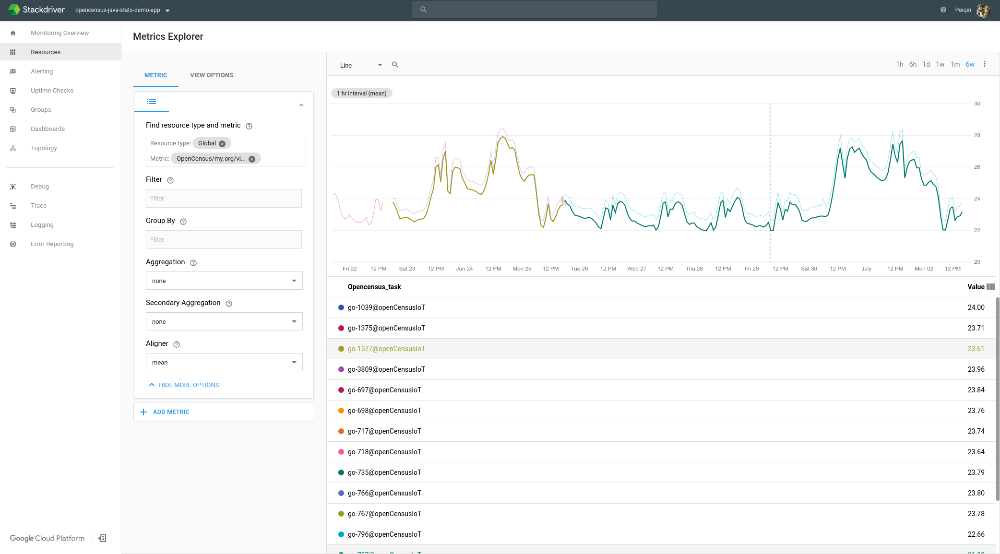
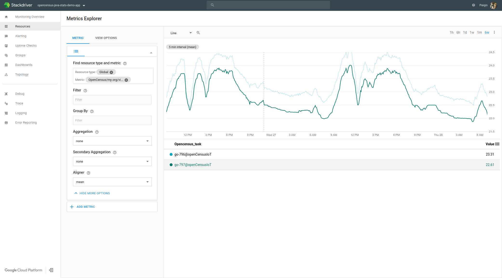
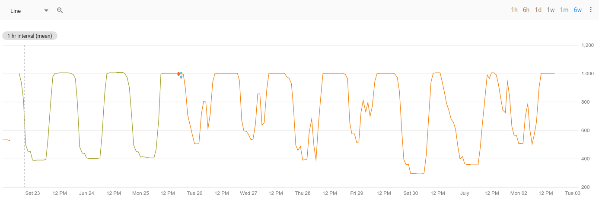
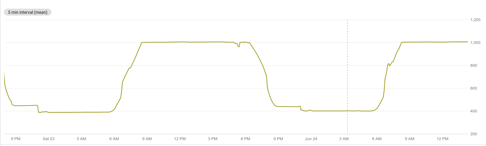

## Table of contents
- [Background](#background)
- [Requirements](#requirements)
- [Packages to import](#packages-to-import)
- [Technical detour](#technical-detour)
- [System I](#system-first)
- [System II](#system-II)
- [Reference](#reference)

### Background

Our application is a prototype which demonstrates how we can utilize OpenCensus for the observability in the IoT industry.  With the service of metric collection and monitoring provided by OpenCensus, we'll gain the insights into hardware and software performance across distributed IoT devices.

### Requirements

* Raspberry Pi 2 B+ with Go 1.8 and greater installed
* PC under Mac OS or Ubuntu
* Raspberry Pi and PC are under the same LAN
* Arduino UNO with Arduino IDE 1.8.5 and greater
* Sensors including DHT11, HTU21D and SparkFun sound detector
* Enable Stackdriver Monitoring on the Project

### Installation

```
go get -u github.com/census-ecosystem/opencensus-experiments
```

### Packages to import

To run the system, we'll import the following packages.

Package Name|Package link
---|---
The OpenCensus Go package|[go.opencensus.io/](https://godoc.org/go.opencensus.io)
The StackDriver exporter package|[contrib.go.opencensus.io/exporter/stackdriver/](https://godoc.org/contrib.go.opencensus.io/exporter/stackdriver)
The Gobot Go package|[gobot.io](https://godoc.org/gobot.io/x/gobot)

Gobot is a framework for robots, drones, and the Internet of Things (IoT), written in the Go programming language.

For more information you can read about it here and get started [Gobot Docs](https://gobot.io/documentation/getting-started)

Since we implement automation of system deployment, details about package installation could be found in the shell scripts referenced in the end of article.

### Technical detour

The application consists of two individual systems.  Both systems are built on Raspberry Pi 2B+.

In the first system, Raspberry Pi collects data from multiple sensors and then calls the API provided by the OpenCensus framework to record the sensor data. The recorded raw data would firstly be aggregated in a user-defined way and then periodically be exported to the backend server such as Stackdriver.  Afterwards, they would be persisted and visualized so that we could verify and analyze them.

In the second system, we redesign the architecture of the above system: Data export is implemented on Raspberry Pi (master) while data collection is implemented on Arduino (slave).  In this way, the system could be more cohesive and low-cost because one expensive Pi could receive data from more cheap sensors.  

Moreover, to decouple the master and slave nodes, we design a robust and low-overhead protocol to support efficient coordination between any IoT device and the master node under OpenCensus. Data collection could be implemented on any cheap embedded platform if it follows the protocol. 

### System I

#### System Configuration

##### Step 1:

```
cd $(go env GOPATH)/src/github.com/census-ecosystem/oepncensus-experiments/go/iot/sensor
./configure.sh raspberry-id raspberry-ip-address rasberry-ssh-password
```

During this step, you would install the required dependencies and configure the Google Cloud environment.  After the configuration, the google cloud default confidentials would be installed in the Pi end.

##### Step 2:

```
./run.sh raspberry-id raspberry-ip-address raspberry-ssh-password
```

When running the above command, the executable binary file would be transmitted to the Raspberry Pi end.  If the environment variable `PROJECTID` is set, the system would run. Otherwise it would throw out an error.

#### System Demo

In the first system, we collect metrics including temperature and light strength inside Google Building MP1 for around ten days. The sensor data is persisted and visualized in the Stackdriver backend.

The temperature data in around ten days is shown as below.



You could see that temperature in the weekends fluctuates much more than that in the weekdays. Moreover, the temperature almost remains constantly around 23 degrees in the weekdays.  The reason for it is that the automated air conditioner only works from 7 AM to 7 PM during weekdays.

The temperature data in a day is shown as below.



From the graph, we could notice the trend that temperature increases more sharply in the morning than that in the afternoon, which proves the high efficiency of air conditioner system inside Google.

It is also worth mentioning that there are actually two plots in the graph, one is highlighted while the other is not. The data sources for these two plots are two individual sensors with the same model.  The difference of the plots shows that the precision and sensitivity of two sensors are quite different. 

The light strength data in a week is shown as below.



The light strength data in a day is shown as below.



On the whole, the light strength shows a very similar trend as the temperature: The light strength would increase to a high level at 6 AM and decrease to a low level at 7 PM every day.  Different from temperature, the light strength would keep this trend in the weekend.

One interesting phenomenon is that there are sometimes sudden peaks during the night in the graph. The reason is that Google TVCs would come to the building for cleaning in the late evening.  Even after they finish their work and leave, there would be a delay for the human detectors inside the building.


### System II

#### System Configuration

Configuration for the system II is very similar to the one in the System I. The only difference is that in the first step.

```
cd $(go env GOPATH)/src/github.com/census-ecosystem/oepncensus-experiments/go/iot/protocol
```

#### System Demo

In the System II, we also collect the temperature but there is large difference in the StackDriver end.

  