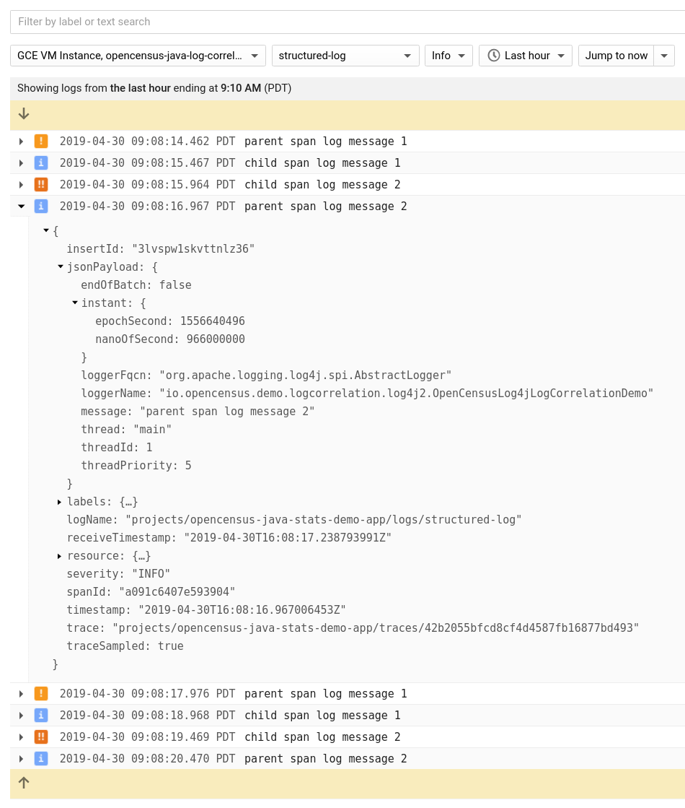
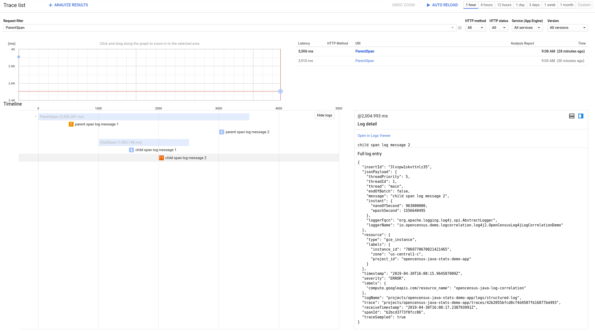

# OpenCensus Log4j 2 Log Correlation Demo

This directory contains an application with Log4j log statements and OpenCensus tracing
instrumentation that can be configured to work with Stackdriver's log correlation features.  This
readme describes how to configure the
[Stackdriver Logging agent](https://cloud.google.com/logging/docs/agent/) to export the
application's log in a format that allows Stackdriver to match the log entries with traces.

## Design of the project

The application logs messages through the Log4j API and creates local traces with `opencensus-api`.
It uses
[`opencensus-contrib-log-correlation-log4j2`](https://github.com/census-instrumentation/opencensus-java/tree/master/contrib/log_correlation/log4j2)
to insert the current trace ID, span ID, and sampling decision into the context of every `LogEvent`
created by Log4j.  That makes the tracing data accessible from Log4j layouts.  Additionally, this
project configures Log4j to output structured, JSON logs.  Structured logs simplify specifying the
tracing fields to be set in the `LogEntry` data structure that the Logging agent exports to
Stackdriver.  The application also directly exports traces to Stackdriver with
`opencensus-exporter-trace-stackdriver`.  Then Stackdriver uses the tracing fields to match the
`LogEntry` and trace on the server side.

### Enabling `opencensus-contrib-log-correlation-log4j2`

The project enables `opencensus-contrib-log-correlation-log4j2` by adding it as a runtime dependency
and specifying its implementation of Log4j's `ContextDataInjector` interface,
`OpenCensusTraceContextDataInjector`.  The class must be specified with the system property
`log4j2.contextDataInjector`, so the project passes
`-Dlog4j2.contextDataInjector=io.opencensus.contrib.logcorrelation.log4j2.OpenCensusTraceContextDataInjector`
to the JVM.

### Configuring Log4j

The project configures Log4j with XML, in [`log4j2.xml`](src/main/resources/log4j2.xml).
`log4j2.xml` specifies a `JsonLayout` that includes a key-value pair for each piece of tracing data.
See the comments in the file for more detail.

## Instructions for setting up Stackdriver log correlation

### Prerequisites

1. A Google Cloud project with Stackdriver [Trace](https://cloud.google.com/trace/) and
[Logging](https://cloud.google.com/logging/) enabled.

2. A VM for running the application and the Stackdriver Logging agent.  Note that its logs may be
uploaded to Stackdriver.  The VM should have Git and Java (JDK 7 or above) installed.

### Setting up log correlation

1. Install the Stackdriver Logging agent on the VM.  Enable structured logging during the
installation process, as described in
https://cloud.google.com/logging/docs/structured-logging#structured-log-install.

2. Clone this repository onto the VM and `cd` into this directory.

3. Add a fluentd configuration file for reading the JSON log file produced by the application, as
described in https://cloud.google.com/logging/docs/agent/configuration#structured-records.  Ensure
that the demo project's `log4j2.xml` and the fluentd configuration specify the same log file.

4. Add the following fluentd filter to transform Log4j's `level` field into the `severity` field
that is expected by Stackdriver.  This snippet can be appended to the file from step 4.  Ensure that
the tag on the first line of the snippet matches the tag in the fluentd configuration file from step 4.

  ```xml
  <filter structured-log>
    @type record_transformer
    <record>
      severity ${record["level"]}
    </record>
    remove_keys "level"
  </filter>
  ```

  TODO(sebright): Simplify this step once fluent-plugin-google-cloud supports overriding the name
of the `severity` field
(https://github.com/GoogleCloudPlatform/fluent-plugin-google-cloud/issues/4).

5. Restart the Stackdriver Logging agent so that it picks up the configuration change:

  ```
  sudo service google-fluentd restart
  ```

6. Run the application:

  ```
  ./gradlew run
  ```

7. Look for the log entries and one sampled trace in Stackdriver.

    Find the log entries by going to the Stackdriver Logging page, as described in
    https://cloud.google.com/logging/docs/view/overview, and filtering by the log name
    ("structured-log").  This screenshot shows the log entries, which contain "trace", "spanId", and
    "traceSampled" fields.  All Log4j log entry fields that are not recognized by Stackdriver appear
    under "jsonPayload":

    

    Find the trace by going to the Trace List page, as described in
    https://cloud.google.com/trace/docs/finding-traces, and searching for the root span name,
    "ParentSpan".  Click on the trace and then click "Show logs" to display the log entries
    associated with each span.

    
