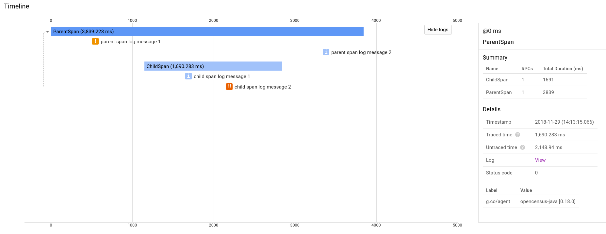
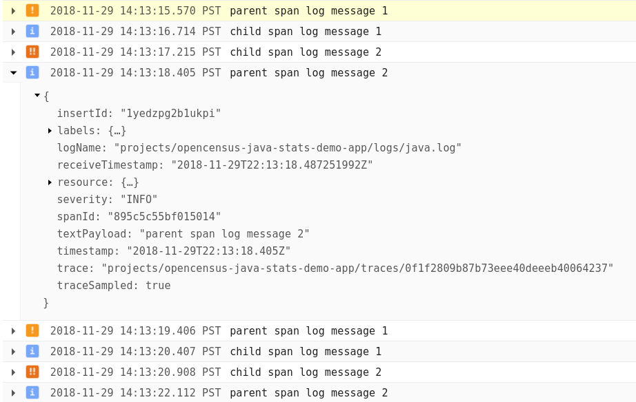

# OpenCensus/Logback/Stackdriver Log Correlation Demo

An application that demonstrates log correlation in Stackdriver with
[`opencensus-contrib-log-correlation-stackdriver`](https://github.com/census-instrumentation/opencensus-java/tree/master/contrib/log_correlation/stackdriver).
The application contains SLF4J log statements and
OpenCensus tracing instrumentation. It configures logging with a Logback XML configuration and
exports logs using the
[Stackdriver Logging Logback appender](https://cloud.google.com/logging/docs/setup/java#logback_appender).
It also exports traces using `opencensus-exporter-trace-stackdriver`, so that Stackdriver can show
the log entries associated with each trace.

The application requires a Google Cloud project with Stackdriver Logging enabled. It can be run with
`./gradlew run`.

## Screenshots from running the demo

Sampled trace in Stackdriver, with log entries displayed below each span:

Log entries containing "trace", "spanId", and "openCensusTraceSampled" fields in Stackdriver:

